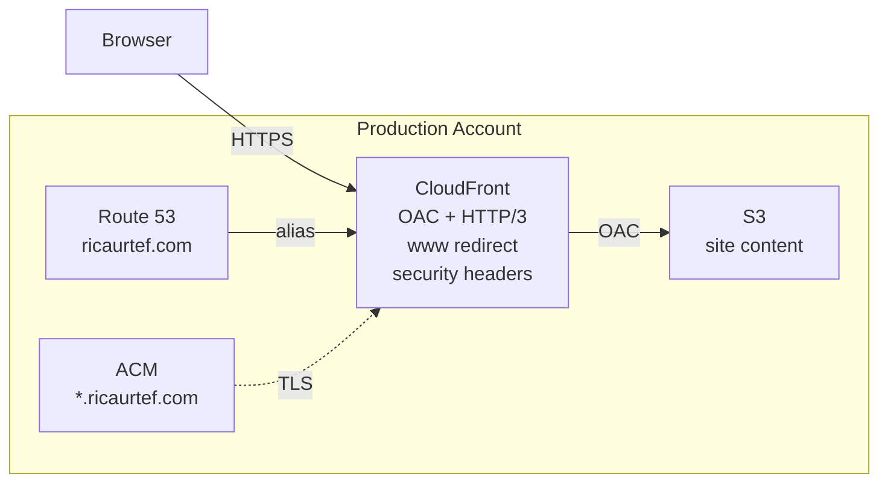
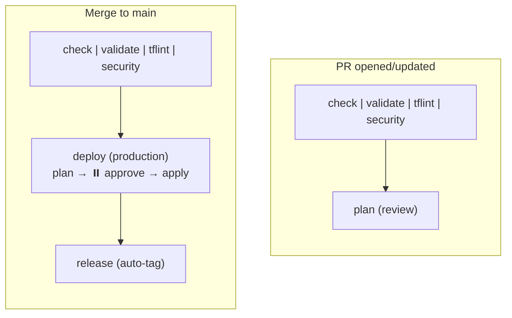

<!-- BEGIN_TF_DOCS -->
# AWS CloudFront Site


---

Provisions a static site on AWS: S3 content bucket, CloudFront distribution with OAC,
ACM certificate, Route 53 hosted zone, and CloudFront Functions for www redirect and
security headers. Designed for [`ricaurtef.com`](https://ricaurtef.com).

## Architecture



## Repository structure

```
aws-cloudfront-site/
├── modules/
│   └── site/               # S3, CloudFront, ACM, Route 53, CF Functions
│       └── functions/       # CloudFront Functions (JS)
├── env/
│   └── production.tfvars   # Environment-specific values
├── .config/                # Integration tooling configs
├── .github/workflows/      # CI/CD pipeline
├── main.tf                 # Module invocation
├── variables.tf            # Root variables (no defaults — driven by tfvars)
├── outputs.tf              # Root outputs
├── providers.tf            # AWS provider (default + us-east-1 alias)
├── backend.tf              # S3 backend (partial — populated at init time)
└── versions.tf             # Terraform + provider version constraints
```

## DNS delegation

This project creates a hosted zone in the production account. For DNS to work,
add the NS records output by `name_servers` to the management account's hosted zone
(or your domain registrar).

## CI/CD pipeline



## Required tools

| Tool | Purpose |
|------|---------|
| [Terraform](https://developer.hashicorp.com/terraform/install) | Infrastructure as Code |
| [terraform-docs](https://terraform-docs.io/user-guide/installation/) | README generation |
| [TFLint](https://github.com/terraform-linters/tflint#installation) | Terraform linter |
| [Checkov](https://www.checkov.io/2.Basics/Installing%20Checkov.html) | Security / policy scanning |
| [Trivy](https://aquasecurity.github.io/trivy/latest/getting-started/installation/) | Vulnerability / secret scanning |
| [pre-commit](https://pre-commit.com/#installation) | Git hook manager |

> Once all tools are installed, run `make setup` to initialise pre-commit hooks, TFLint plugins,
> and the Terraform working directory.

## Requirements

| Name | Version |
|------|---------|
| <a name="requirement_terraform"></a> [terraform](#requirement\_terraform) | ~> 1.14 |
| <a name="requirement_aws"></a> [aws](#requirement\_aws) | ~> 6.27 |
## Providers

No providers.
## Modules

| Name | Source | Version |
|------|--------|---------|
| <a name="module_site"></a> [site](#module\_site) | ./modules/site | n/a |
## Inputs

| Name | Description | Type | Default | Required |
|------|-------------|------|---------|:--------:|
| <a name="input_deploy_role_arn"></a> [deploy\_role\_arn](#input\_deploy\_role\_arn) | ARN of the IAM role to assume for deploying resources (hub-and-spoke). | `string` | n/a | yes |
| <a name="input_domain_name"></a> [domain\_name](#input\_domain\_name) | Apex domain name. | `string` | n/a | yes |
| <a name="input_environment"></a> [environment](#input\_environment) | Deployment environment (e.g., production, staging). | `string` | n/a | yes |
| <a name="input_region"></a> [region](#input\_region) | AWS region for primary resources. | `string` | n/a | yes |
| <a name="input_site_bucket_name"></a> [site\_bucket\_name](#input\_site\_bucket\_name) | Name of the S3 bucket for site content. | `string` | n/a | yes |
## Outputs

| Name | Description |
|------|-------------|
| <a name="output_cloudfront_distribution_id"></a> [cloudfront\_distribution\_id](#output\_cloudfront\_distribution\_id) | CloudFront distribution ID (used for cache invalidation). |
| <a name="output_name_servers"></a> [name\_servers](#output\_name\_servers) | NS records to configure in the management account for DNS delegation. |
| <a name="output_site_url"></a> [site\_url](#output\_site\_url) | Public URL of the site. |
<!-- END_TF_DOCS -->